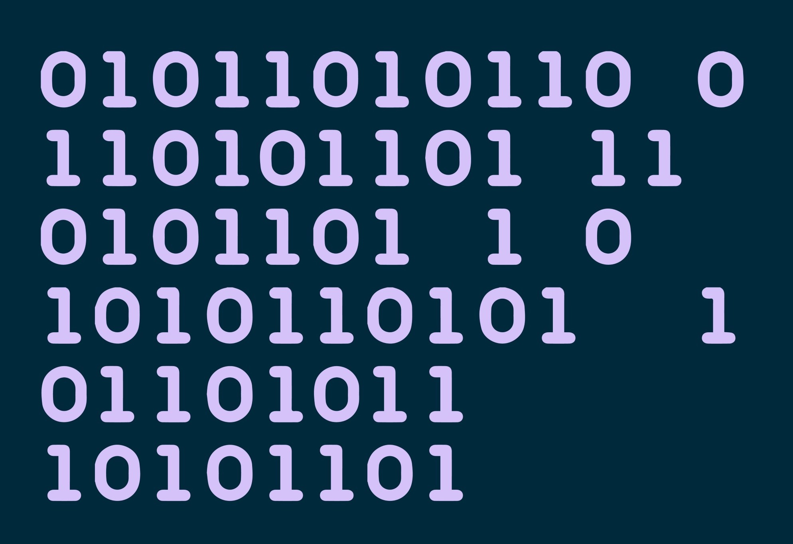
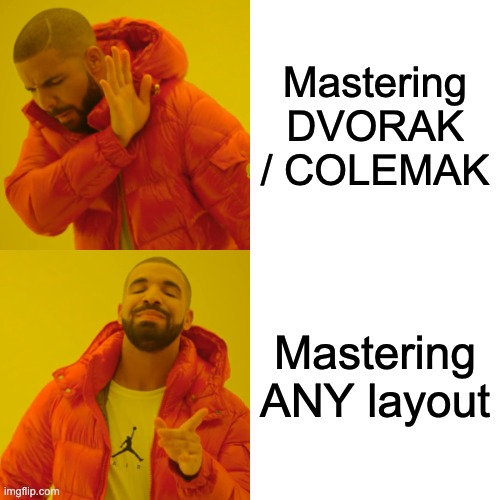

```{r setup, include=FALSE}
library(knitr)
library(fontawesome)
library(tidyverse)
library(metathis)
library(logitr)

options(
  htmltools.dir.version = FALSE,
  knitr.table.format = "html",
  knitr.kable.NA = '',
  dplyr.width = Inf,
  width = 250
)

knitr::opts_chunk$set(
  cache = FALSE,
  warning = FALSE,
  message = FALSE,
  fig.path = "figs/",
  fig.width = 7.252,
  fig.height = 4,
  comment = "#>",
  fig.retina = 3
)

# Setup xaringanExtra options
xaringanExtra::use_xaringan_extra(c(
  "tile_view", "panelset", "share_again"))
xaringanExtra::style_share_again(share_buttons = "none")
xaringanExtra::use_extra_styles(
  hover_code_line = TRUE,
  mute_unhighlighted_code = FALSE
)
xaringanExtra::use_freezeframe(responsive = FALSE)

# Set up website metadata
meta() %>%
  meta_general(
    description = rmarkdown::metadata$title,
    generator = "xaringan and remark.js"
  ) %>%
  meta_name("github-repo" = "jhelvy/2021-useR-healthy-hands") %>%
  meta_social(
    title = rmarkdown::metadata$title,
    url = "https://jhelvy.com",
    og_type = "website",
    og_author = "John Paul Helveston",
    twitter_card_type = "summary_large_image",
    twitter_creator = "@johnhelveston"
  )

knitr::opts_chunk$set(
    warning = FALSE,
    message = FALSE,
    comment = "#>",
    fig.path = "figs/",
    fig.retina = 3 # Better figure resolution
)
```

layout: true

<!-- this adds the link footer to all slides, depends on my-footer class in css-->

<div class="footer-small">
<span>
https://github.com/jhelvy/2021-useR-healthy-hands
</span>
</div>

---

name: title-slide
class: inverse, middle

# Healthier ❤️ & Happier 😄 Hands 🙌

.leftcol70[
## Software and Hardware Solutions for More Ergonomic Typing

### by John Paul Helveston

### 2021 useR! Conference
]

.rightcol30[
<br><center>

</center>
]

???

Hi everyone, my name is John Paul Helveston 

and I want to talk about solutions to keep our hands healthy

---

class: center
background-color: #fff

## **Last year I typed 7.5 million key strokes**

<center>

</center>

???

If you're like me and use R on a daily basis, 

chances are you are probably racking up some serious 

mileage on your keyboard. 

Over the past year, I myself typed 7.5 million key strokes, 

and in some months I log over 1 million.

---

background-image: url("images/hands.jpg")
background-size: contain

???

With that level of wear and tear, 

I started noticing a lot of wrist pain. 

So I began a quest to find solutions.

My goal of this talk is just to share what I've found 

in the hopes that it might be helpful for others.

---

class: inverse, middle, center

.leftcol[
# Software
<center>

</center>
]

.rightcol[
# Hardware
<center>

</center>
]

???

I've broken my talk into two categories: 

Software and Hardware

---

class: inverse, middle, center

.leftcol[
# .green[Software]
<center>

</center>
]

.rightcol[
# Hardware
<center>

</center>
]

???

So I'll start with software

---

class: center

# Disclaimer

## This talk is aimed at people who don't use Vim / Emacs

.leftcol[
<center>

</center>
]

.rightcol[
<center>

</center>
]

???

Before I go any further, I want to first say this talk is aimed 

at people who don't use platforms like Vim and Emacs.

Many of the solutions I'll mention are easily handled on these platforms, 

but they come with a learning curve, and not everyone uses them.

So I'm going to highlight ideas that are hopefully useful for 

any general typist.

---

class: center
background-color: #fff

# Learn to touch type _well_

### https://www.keybr.com/

<center>

</center>

???

My first suggestion is really basic, and that's 

to learn to touch type well, and by that I don't just mean 

use all 10 fingers while typing.

---

class: center

# Learn to touch type _well_

### https://www.keybr.com/

<center>
<blockquote class="twitter-tweet"><p lang="en" dir="ltr">Periodic programming advice: practice your touch typing skills. If you type less than 90 wpm and/or look at the keys, your typing speed is likely to be a programming bottleneck. Fortunately, it&#39;s one of the easiest bottlenecks to fix with a little deliberate practice.</p>&mdash; Hadley Wickham (@hadleywickham) <a href="https://twitter.com/hadleywickham/status/1169603647614967808?ref_src=twsrc%5Etfw">September 5, 2019</a></blockquote> <script async src="https://platform.twitter.com/widgets.js" charset="utf-8"></script>
</center>

???

I mean actually practice your typing skills. 

Hadley Wickham actually tweeted about this, 

suggesting people aim for somewhere between 60 to 90

words per minute. I found that with just a little 

bit of consistent practice, over a month I increased my 

typing speed by about 30 words per minute. 

There are lots of great free tools out there 

for practice, and my personal favorite is key-br-dot-com.

---

class: middle, center
background-color: #fff

<center>

</center>

???

The other thing I'll note on this is that I personally haven't 

seen much benefit to learning alternative keyboard layouts. 

While you can gain a little bit of typing speed by 

learning an alternative like DVORAK or COLEMAK, it's much, much 

more important that you really master ANY layout really well. 

---

# .center[Learn shortcuts]

.leftcol[
Insert a `<-` operator:

- **Windows**: `ALT` + `-`
- **Mac**: `OPTION` + `-`
]

.rightcol[
Insert a `%>%` operator:

- **Windows**: `CTRL` + `SHIFT` + `M`
- **Mac**: `COMMAND` + `SHIFT` + `M`
]

???

My next suggestion is to learn your shortcuts.

There are some really useful simple ones, like 

using "alt" + "dash" to create an assignment operator, 

or "Command" "shift" "M" to make a pipe.

---

class: center

# Learn shortcuts

.leftcol40[
## Align messy code:

## `Ctrl + I`
]

.rightcol60[
<center>
<blockquote class="twitter-tweet"><p lang="en" dir="ltr">One of my favorite <a href="https://twitter.com/rstudio?ref_src=twsrc%5Etfw">@rstudio</a> shortcuts: Ctrl+I. If your code is misaligned/messy for whatever reason, RStudio will clean it right up for you. <a href="https://twitter.com/hashtag/rstats?src=hash&amp;ref_src=twsrc%5Etfw">#rstats</a> <a href="https://t.co/BzPaPhP9Zl">pic.twitter.com/BzPaPhP9Zl</a></p>&mdash; Kyle Walker (@kyle_e_walker) <a href="https://twitter.com/kyle_e_walker/status/1117801495884386304?ref_src=twsrc%5Etfw">April 15, 2019</a></blockquote> <script async src="https://platform.twitter.com/widgets.js" charset="utf-8"></script>
</center>
]

???

But there are lots of lesser-known ones that are really useful, 

like using control + I to auto-align messy code

---

class: center

# Learn shortcuts

.leftcol40[
## Use multiple cursors:

## Hold `Alt/Option` + <br>click & drag 
]

.rightcol60[
<center>
<blockquote class="twitter-tweet"><p lang="en" dir="ltr">Loved the cooking metaphors 🔪🎂 in <a href="https://twitter.com/hadleywickham?ref_src=twsrc%5Etfw">@hadleywickham</a>&#39;s <a href="https://twitter.com/RLadiesSF?ref_src=twsrc%5Etfw">@RLadiesSF</a> talk yesterday! but the best part was watching Hadley speed-code live and learning neat tricks like this: <a href="https://t.co/UVmrPbxpho">pic.twitter.com/UVmrPbxpho</a></p>&mdash; Irene Steves (@i_steves) <a href="https://twitter.com/i_steves/status/995394452821721088?ref_src=twsrc%5Etfw">May 12, 2018</a></blockquote> <script async src="https://platform.twitter.com/widgets.js" charset="utf-8"></script>
</center>
]

???

Or another one of my favorites is to hold Alt or Option 

and then click and drag to generate multiple cursors.

This is really helpful for doing things like editing 

elements in a vector.

---

# .center[Use a text expander]

<br><br><br>
<center>

</center>

???

If you want to go beyond shortcuts supported in RStudio, 

you can create your own using a text expander program.

I use an open source text expander called espanso 

to convert all sorts of short text snippets into larger blocks of text.

---

# .center[Use a text expander]

.leftcol40[
`ggpoint`

```{r, eval=FALSE}
ggplot() +
    geom_point(aes(x = , y = ))
```

`ggsxc`

```{r, eval=FALSE}
scale_x_continuous() +
```

`ggsyc`

```{r, eval=FALSE}
scale_y_continuous() +
```
]

.rightcol60[
<br><center>

</center>
]

???

In this example, I use the trigger "ggpoint" to quickly create 

the code for a scatterplot, and I also use the triggers "ggsxc" "ggsyc"

to expand to scale_x_continuous and scale_y_continuous.

This not only helps with speed, but also accuracy as I tend to

have fewer typos when using these expansions to write code. 

---

# .center[Use a text expander]

.leftcol[
`rrsetup`

````markdown
`r ''````{r setup, include=FALSE}
knitr::opts_chunk$set(
  warning = FALSE,
  message = FALSE,
  fig.path = "figs/",
  fig.width = 7.252,
  fig.height = 4,
  comment = "#>",
  fig.retina = 3
)
```
````
]

???

This becomes particularly handy for any common code chunks 

you use. For example, this is my typical "setup" code chunk 

in most of my RMarkdown documents.

---

class: center

# Remap your keyboard

---

class: center

# Use layers

Navigation with layers

---

class: inverse, middle, center

.leftcol[
# Software
<center>

</center>
]

.rightcol[
# .green[Hardware]
<center>

</center>
]

???

So that was a lot of different software solutions

and hopefully some of those will work well for you

But there's also a lot to be gained by carefully 

considering the hardware you use.

---

class: center

# Use a timer

???

While I'm mostly going to talk about which keyboard you use,

I want to start by saying that 

---

class: center

# Use a split keyboard

(inexpensive first)

---

class: center

# Use a split keyboard _that has thumb keys_

---

class: center

# Use a split keyboard _that is programmable_

---

class: inverse

<br>

# .center[.font150[Thanks!]]

### Slides: https://jhelvy.github.io/2021-useR-healthy-hands

.footer-large[
.right[
@johnhelveston `r fa(name = "twitter", fill = "white")`<br>
@jhelvy `r fa(name = "github", fill = "white")`<br>
@jhelvy `r fa(name = "weixin", fill = "white")`<br>
jhelvy.com `r fa(name = "link", fill = "white")`<br>
jph@gwu.edu `r fa(name = "paper-plane", fill = "white")`
]]
