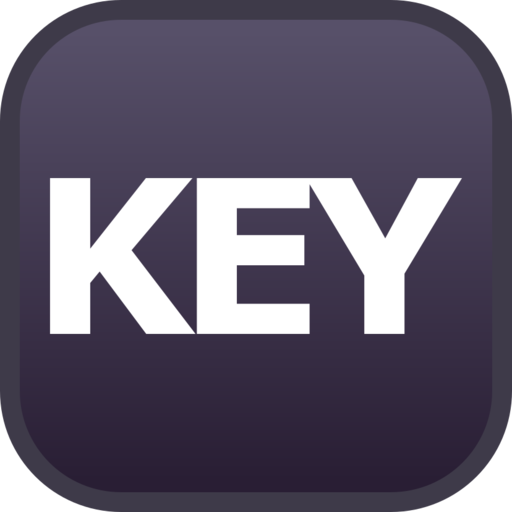

```{r setup, include=FALSE}
library(knitr)
library(fontawesome)
library(tidyverse)
library(metathis)
library(logitr)

options(
  htmltools.dir.version = FALSE,
  knitr.table.format = "html",
  knitr.kable.NA = '',
  dplyr.width = Inf,
  width = 250
)

knitr::opts_chunk$set(
  cache = FALSE,
  warning = FALSE,
  message = FALSE,
  fig.path = "figs/",
  fig.width = 7.252,
  fig.height = 4,
  comment = "#>",
  fig.retina = 3
)

# Setup xaringanExtra options
xaringanExtra::use_xaringan_extra(c(
  "tile_view", "panelset", "share_again"))
xaringanExtra::style_share_again(share_buttons = "none")
xaringanExtra::use_extra_styles(
  hover_code_line = TRUE,
  mute_unhighlighted_code = FALSE
)
xaringanExtra::use_freezeframe(responsive = FALSE)

# Set up website metadata
meta() %>%
  meta_general(
    description = rmarkdown::metadata$title,
    generator = "xaringan and remark.js"
  ) %>%
  meta_name("github-repo" = "jhelvy/2021-useR-healthy-hands") %>%
  meta_social(
    title = rmarkdown::metadata$title,
    url = "https://jhelvy.com",
    og_type = "website",
    og_author = "John Paul Helveston",
    twitter_card_type = "summary_large_image",
    twitter_creator = "@johnhelveston"
  )

knitr::opts_chunk$set(
    warning = FALSE,
    message = FALSE,
    comment = "#>",
    fig.path = "figs/",
    fig.retina = 3 # Better figure resolution
)
```

layout: true

<!-- this adds the link footer to all slides, depends on my-footer class in css-->

<div class="footer-small">
<span>
https://github.com/jhelvy/2021-useR-healthy-hands
</span>
</div>

---

name: title-slide
class: inverse, middle

# Healthier ❤️ & Happier 😄 Hands 🙌

.leftcol70[
## Software and Hardware Solutions for More Ergonomic Typing

### by John Paul Helveston

### 2021 useR! Conference
]

.rightcol30[
<br><center>

</center>
]

???

Hi everyone, my name is John Paul Helveston 

and I want to talk about solutions to keep our hands healthy

---

class: center
background-color: #fff

## **Last year I typed 7.5 million key strokes**

<center>

</center>

???

If you're like me and use R on a daily basis, 

chances are you are probably racking up some serious 

mileage on your keyboard. 

Over the past year, I myself typed 7.5 million key strokes, 

and in some months I log over 1 million.

---

background-image: url("images/hands.jpg")
background-size: contain

???

With that level of wear and tear, 

I started noticing a lot of wrist pain. 

So I began a quest to find solutions.

My goal of this talk is just to share what I've found 

in the hopes that it might be helpful for others.

---

class: inverse, middle, center

.leftcol[
# Software
<center>

</center>
]

.rightcol[
# Hardware
<center>

</center>
]

???

I've broken my talk into two categories: 

Software and Hardware

---

class: inverse, middle, center

.leftcol[
# .green[Software]
<center>

</center>
]

.rightcol[
# Hardware
<center>

</center>
]

???

So I'll start with software

---

class: center

# Disclaimer

## This talk is aimed at people who don't use Vim / Emacs

.leftcol[
<center>

</center>
]

.rightcol[
<center>

</center>
]

???

Before I go any further, I want to first say this talk is aimed 

at people who don't use platforms like Vim and Emacs.

These platforms are great, and if you use them, fantastic,

But not everyone does, so I'm going to highlight ideas that 

are hopefully useful for any general typist.

---

class: center
background-color: #fff

# Learn to touch type _well_

### https://www.keybr.com/

<center>

</center>

???

My first suggestion is really basic, and that's 

to learn to touch type well, and by that I don't just mean 

use all 10 fingers while typing.

---

class: center

# Learn to touch type _well_

### https://www.keybr.com/

<center>
<blockquote class="twitter-tweet"><p lang="en" dir="ltr">Periodic programming advice: practice your touch typing skills. If you type less than 90 wpm and/or look at the keys, your typing speed is likely to be a programming bottleneck. Fortunately, it&#39;s one of the easiest bottlenecks to fix with a little deliberate practice.</p>&mdash; Hadley Wickham (@hadleywickham) <a href="https://twitter.com/hadleywickham/status/1169603647614967808?ref_src=twsrc%5Etfw">September 5, 2019</a></blockquote> <script async src="https://platform.twitter.com/widgets.js" charset="utf-8"></script>
</center>

???

I mean actually practice your typing skills. 

Hadley Wickham actually tweeted about this, 

saying you should aim for 90 words per minute. 

(he later wrote maybe 60 is more reasonable). 

I found that with just a little bit of consistent 

practice on key-br-dot-com, I increased my 

typing speed from about 60 to 90 words per minute 

in just one month. But it's not just about speed - 

it's about accuracy as well. The fewer times you have 

to press backspace the better.

---

class: middle, center
background-color: #fff

<center>

</center>

???

The other thing I'll note on this is that I personally haven't 

seen much benefit to learning alternative keyboard layouts. 

While you can gain a little bit of typing speed by 

learning an alternative like DVORAK or COLEMAK, it's much, much 

more important that you really master ANY layout really well.

---

# .center[Learn shortcuts]

.leftcol[
Insert a `<-` operator:

- **Windows**: `ALT` + `-`
- **Mac**: `OPTION` + `-`
]

.rightcol[
Insert a `%>%` operator:

- **Windows**: `CTRL` + `SHIFT` + `M`
- **Mac**: `COMMAND` + `SHIFT` + `M`
]

???

My next suggestion is to learn your shortcuts.

RStudio is packed with super useful ones, like 

using "alt" + "dash" to create an assignment operator, 

or "Command" "shift" "M" to make a pipe.

---

class: center

# Learn shortcuts

.leftcol40[
## Align messy code:

## `Ctrl + I`
]

.rightcol60[
<center>
<blockquote class="twitter-tweet"><p lang="en" dir="ltr">One of my favorite <a href="https://twitter.com/rstudio?ref_src=twsrc%5Etfw">@rstudio</a> shortcuts: Ctrl+I. If your code is misaligned/messy for whatever reason, RStudio will clean it right up for you. <a href="https://twitter.com/hashtag/rstats?src=hash&amp;ref_src=twsrc%5Etfw">#rstats</a> <a href="https://t.co/BzPaPhP9Zl">pic.twitter.com/BzPaPhP9Zl</a></p>&mdash; Kyle Walker (@kyle_e_walker) <a href="https://twitter.com/kyle_e_walker/status/1117801495884386304?ref_src=twsrc%5Etfw">April 15, 2019</a></blockquote> <script async src="https://platform.twitter.com/widgets.js" charset="utf-8"></script>
</center>
]

???

But there are lots of lesser-known ones, 

like using control + I to auto-align messy code

---

class: center

# Learn shortcuts

.leftcol40[
## Use multiple cursors:

## Hold `Alt/Option` + <br>click & drag 
]

.rightcol60[
<center>
<blockquote class="twitter-tweet"><p lang="en" dir="ltr">Loved the cooking metaphors 🔪🎂 in <a href="https://twitter.com/hadleywickham?ref_src=twsrc%5Etfw">@hadleywickham</a>&#39;s <a href="https://twitter.com/RLadiesSF?ref_src=twsrc%5Etfw">@RLadiesSF</a> talk yesterday! but the best part was watching Hadley speed-code live and learning neat tricks like this: <a href="https://t.co/UVmrPbxpho">pic.twitter.com/UVmrPbxpho</a></p>&mdash; Irene Steves (@i_steves) <a href="https://twitter.com/i_steves/status/995394452821721088?ref_src=twsrc%5Etfw">May 12, 2018</a></blockquote> <script async src="https://platform.twitter.com/widgets.js" charset="utf-8"></script>
</center>
]

???

Or another one of my favorites is to hold Alt or Option 

and then click and drag to generate multiple cursors.

This is really helpful for doing things like editing 

elements in a vector.

---

# .center[Use a text expander]

<center>

<br>
Powered by 
</center>

???

But shortcuts are just a starting point for streamlining your typing.

There is a whole class of programs called text expanders

convert short text "triggers" into pre-formatted 

snippets. My favorite is espanso, which is an open source 

expander written in Rust, that is super easy to customize.  

---

# .center[Use a text expander]

.leftcol40[
`ggpoint`

```{r, eval=FALSE}
ggplot() +
    geom_point(aes(x = , y = ))
```

`ggsxc`

```{r, eval=FALSE}
scale_x_continuous() +
```

`ggsyc`

```{r, eval=FALSE}
scale_y_continuous() +
```
]

.rightcol60[
<br><center>

</center>
]

???

In this example, you can see how I use the trigger "ggpoint" 

to quickly create ggplot code for a scatterplot, 

and I also use a couple other quick triggers to 

generate some code for the x and y axes.

---

# .center[Use a text expander]

.leftcol[
`rrsetup`

````markdown
`r ''````{r setup, include=FALSE}
knitr::opts_chunk$set(
  warning = FALSE,
  message = FALSE,
  fig.path = "figs/",
  fig.width = 7.252,
  fig.height = 4,
  comment = "#>",
  fig.retina = 3
)
```
````
]

???

One of my favorite custom expansions is the trigger

rrsetup, which generates this whole RMarkdown setup code 

chunk, which I use in most of my RMarkdown documents.

---

class: center 

# Use a text expander

<br>

## https://www.jhelvy.com/blog

???

If you want to learn more about espanso in particular, 

I wrote a whole blog post about it on my website at 

jhelvy.com

---

class: center

# Use additional keyboard layers

<br>

--

.cols3[
<center>
1234567890
<br>
qwertyuiop
<br>
asdfgjhkl'
<br>
zxcvnm,./
</center>
]

.cols3[
<center>

</center>
]

.cols3[
<center>
!@#$%^&*()
<br>
QWERTYUIOP
<br>
ASDFGHJKL"
<br>
ZXCVBNM<>?
</center>
]

???

My third suggestion is to use additional keyboard layers.

Most keyboards have several layers. For example, 

when you hold down the "shift" key, you engage a new layer

where lower-case letters become upper-case,

and numbers become symbols. This is really useful because 

it allows us to keep our hands in one place while 

accessing other keys.

---

background-color: #fff
class: middle

<center>

</center>

???

Unfortunately, many of the most useful keys for coding,

like our navigation arrows, require us to move our hands

away from the home row position. 

---

background-color: #fff
class: middle

<center>

</center>

???

A nice solution is to make these and other convenient 

keys available from a new layer so I don't have to 

keep moving my hands

---

class: center, middle

.leftcol[
# Windows 

#### https://www.autohotkey.com/

<center>

</center>
]

.rightcol[
# Mac 

#### https://karabiner-elements.pqrs.org/

<center>

</center>
]

???

There are a number of programs that support this. 

On Windows most people use Auto-hot-key, 

and on Mac there's a similar program called 

Karabiner Elements. These are both very flexible 

programs that allow you to customize and remap 

your entire keyboard.

---

background-color: #fff
class: center

# Caps Lock Layer

<center>

</center>

???

As an example, on my keyboard I've used 

Karabiner-Elements to re-map my caps lock key

such that when held down I get a new layer that 

has navigation arrows under my right hand, and 

cut, copy, and paste under my left

---


???

This enables me quickly navigate around in

RStudio and manipulate code without ever 

needing to leave the home row position.


---

class: inverse, middle, center

.leftcol[
# Software
<center>

</center>
]

.rightcol[
# .green[Hardware]
<center>

</center>
]

???

So that was a lot of different software solutions

and hopefully some of those will work well for you

But there's also a lot to be gained by carefully 

considering the hardware you use.

---

class: center

# Use a timer

???

While I'm mostly going to talk about which keyboard you use,

I want to start by saying that 

---

class: center

# Use a split keyboard

(inexpensive first)

---

class: center

# Use a split keyboard _that has thumb keys_

---

class: center

# Use a split keyboard _that is programmable_

---

class: inverse

<br>

# .center[.font150[Thanks!]]

### Slides: https://jhelvy.github.io/2021-useR-healthy-hands

.footer-large[
.right[
@johnhelveston `r fa(name = "twitter", fill = "white")`<br>
@jhelvy `r fa(name = "github", fill = "white")`<br>
@jhelvy `r fa(name = "weixin", fill = "white")`<br>
jhelvy.com `r fa(name = "link", fill = "white")`<br>
jph@gwu.edu `r fa(name = "paper-plane", fill = "white")`
]]
