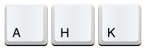

```{r setup, include=FALSE}
library(knitr)
library(fontawesome)
library(tidyverse)
library(metathis)
library(logitr)

options(
  htmltools.dir.version = FALSE,
  knitr.table.format = "html",
  knitr.kable.NA = '',
  dplyr.width = Inf,
  width = 250
)

knitr::opts_chunk$set(
  cache = FALSE,
  warning = FALSE,
  message = FALSE,
  fig.path = "figs/",
  fig.width = 7.252,
  fig.height = 4,
  comment = "#>",
  fig.retina = 3
)

# Setup xaringanExtra options
xaringanExtra::use_xaringan_extra(c(
  "tile_view", "panelset", "share_again"))
xaringanExtra::style_share_again(share_buttons = "none")
xaringanExtra::use_extra_styles(
  hover_code_line = TRUE,
  mute_unhighlighted_code = FALSE
)

# Set up website metadata
meta() %>%
  meta_general(
    description = rmarkdown::metadata$title,
    generator = "xaringan and remark.js"
  ) %>%
  meta_name("github-repo" = "jhelvy/2021-useR-healthy-hands") %>%
  meta_social(
    title = rmarkdown::metadata$title,
    url = "https://jhelvy.com",
    og_type = "website",
    og_author = "John Paul Helveston",
    twitter_card_type = "summary_large_image",
    twitter_creator = "@johnhelveston"
  )

knitr::opts_chunk$set(
    warning = FALSE,
    message = FALSE,
    comment = "#>",
    fig.path = "figs/",
    fig.retina = 3 # Better figure resolution
)
```

layout: true

<!-- this adds the link footer to all slides, depends on my-footer class in css-->

<div class="footer-small">
<span>
https://github.com/jhelvy/2021-useR-healthy-hands
</span>
</div>

---

name: title-slide
class: inverse, middle

# Healthier ❤️ & Happier 😄 Hands 🙌

.leftcol70[
## Software and Hardware Solutions for More Ergonomic Typing

### by John Paul Helveston

### 2021 useR! Conference
]

.rightcol30[
<br><center>

</center>
]

???

Hi everyone, my name is John Paul Helveston 

and I want to talk about solutions to keep our hands 

happy and healthy

---

class: center
background-color: #fff

## **Last year I typed 7.5 million key strokes**

<center>

</center>

???

I use R on a daily basis, and over the past year, I 

typed 7.5 million key strokes. 

In some months I logged over 1 million.

---

background-image: url("images/hands.jpg")
background-size: contain

???

With that level of wear and tear, 

I started noticing a lot of wrist pain. 

So I began a quest to find solutions.

And this talk is just a summary of what I've found.

---

class: inverse, middle, center

.leftcol[
# Efficient typing
<center>

</center>
]

.rightcol[
# Ergonomic keyboards
<center>

</center>
]

???

I've organized my thoughts into two categories:

To be more efficient in my typing, and  

to use more a more ergonomic keyboard

---

class: inverse, middle, center

.leftcol[
# .green[Efficient typing]
<center>

</center>
]

.rightcol[
# Ergonomic keyboards
<center>

</center>
]

???

So I'll start with efficiency

---

class: center
background-color: #fff

# Learn to touch type _well_

## https://www.keybr.com/

<center>

</center>

???

My first suggestion is really basic, and that's 

to learn to touch type well, and by that I don't just mean 

use all 10 fingers while typing.

I mean actually practice your typing.

I found that with just a little bit of consistent 

practice on key-br-dot-com, I increased my 

typing speed from about 60 to 90 words per minute 

in just one month. But I also found that my typing 

accuracy improved. As simple as it sounds, some regular 

typing practice can really go a long way.

---

# .center[Learn shortcuts]

.leftcol[
Insert a `<-` operator:

- **Windows**: `ALT` + `-`
- **Mac**: `OPTION` + `-`
]

.rightcol[
Insert a `%>%` operator:

- **Windows**: `CTRL` + `SHIFT` + `M`
- **Mac**: `COMMAND` + `SHIFT` + `M`
]

???

My next suggestion is to master keyboard shortcuts.

RStudio is packed with super useful ones, like 

using "alt" + "dash" to create an assignment operator, 

or "Command" "shift" "M" to make a pipe.

---

class: center

# Learn shortcuts

.leftcol40[
## Align messy code:

## `Ctrl + I`
]

.rightcol60[
<center>
<blockquote class="twitter-tweet"><p lang="en" dir="ltr">One of my favorite <a href="https://twitter.com/rstudio?ref_src=twsrc%5Etfw">@rstudio</a> shortcuts: Ctrl+I. If your code is misaligned/messy for whatever reason, RStudio will clean it right up for you. <a href="https://twitter.com/hashtag/rstats?src=hash&amp;ref_src=twsrc%5Etfw">#rstats</a> <a href="https://t.co/BzPaPhP9Zl">pic.twitter.com/BzPaPhP9Zl</a></p>&mdash; Kyle Walker (@kyle_e_walker) <a href="https://twitter.com/kyle_e_walker/status/1117801495884386304?ref_src=twsrc%5Etfw">April 15, 2019</a></blockquote> <script async src="https://platform.twitter.com/widgets.js" charset="utf-8"></script>
</center>
]

???

But there are lots of lesser-known ones, 

like selecting some messy code and using 

control + I to auto-align everything.

---

class: center

# Learn shortcuts

.leftcol40[
## Use multiple cursors:

## Hold `Alt/Option` + <br>click & drag 
]

.rightcol60[
<center>
<blockquote class="twitter-tweet"><p lang="en" dir="ltr">Loved the cooking metaphors 🔪🎂 in <a href="https://twitter.com/hadleywickham?ref_src=twsrc%5Etfw">@hadleywickham</a>&#39;s <a href="https://twitter.com/RLadiesSF?ref_src=twsrc%5Etfw">@RLadiesSF</a> talk yesterday! but the best part was watching Hadley speed-code live and learning neat tricks like this: <a href="https://t.co/UVmrPbxpho">pic.twitter.com/UVmrPbxpho</a></p>&mdash; Irene Steves (@i_steves) <a href="https://twitter.com/i_steves/status/995394452821721088?ref_src=twsrc%5Etfw">May 12, 2018</a></blockquote> <script async src="https://platform.twitter.com/widgets.js" charset="utf-8"></script>
</center>
]

???

Or to hold the Alt key then click and drag to 

generate multiple cursors. This is really helpful 

for doing things like editing elements in a vector.

---

# .center[Use a text expander]

.leftcol40[
`ggpoint`

```{r, eval=FALSE}
ggplot() +
    geom_point(aes(x = , y = ))
```

`ggsxc`

```{r, eval=FALSE}
scale_x_continuous() +
```

`ggsyc`

```{r, eval=FALSE}
scale_y_continuous() +
```
]

.rightcol60[
<br><center>

<br>
Powered by 
</center>
]

???

I also highly recommend using a text expander, 

which are programs that convert short keywords 

into pre-formatted text snippets. 

In this example, you can see how I use the keywords 

on the left to quickly create some ggplot code for 

a scatterplot. I use an open source expander 

called espanso that is super easy to use 

to create your own custom expansions like I did here.

---

class: center

# Use a text expander

`rrsetup`

<center>

<br>
Powered by 
</center>

???

I custom expansions for all sorts of things.

For example, I use the keyword 'rrsetup' to generate

this whole code chunk, which I use at the start of most of my 

RMarkdown documents.

---

class: center 

# Use a text expander

<br>

<center>

</center>

## https://www.jhelvy.com/blog

???

The particular expander I use is an open source one  

called espanso that is super easy to customize. 

If you want to learn more, I wrote a whole 

blog post about it on my website at jhelvy.com

---

class: center

# Use keyboard layers

<br>

.cols3[
## .center[Base layer]
<center>
1234567890
<br>
qwertyuiop
<br>
asdfgjhkl'
<br>
zxcvnm,./
</center>
]

.cols3[
<br>
<center>

</center>
]

.cols3[
## .center[Shift layer]
<center>
!@#$%^&*()
<br>
QWERTYUIOP
<br>
ASDFGHJKL"
<br>
ZXCVBNM<>?
</center>
]

???

My third suggestion is to use keyboard layers.

Though you might not think of it this way, every 

keyboard has multiple layers. For example, 

when you hold the "shift" key, the lower-case 

letters become upper-case, and numbers become symbols. 

This is really useful because it allows us to keep 

our hands in one place while accessing other keys.

---

background-color: #fff
class: middle

<center>

</center>

???

Unfortunately, many of the most useful keys for coding,

like our navigation arrows, require us to move our hands

away from the home row position. 

---

background-color: #fff
class: middle

<center>

</center>

???

A nice solution is to use layers to move these keys 

back under our home row position.

---

class: center, middle

.leftcol[
# Windows 

#### https://www.autohotkey.com/

<center>

</center>
]

.rightcol[
# Mac 

#### https://karabiner-elements.pqrs.org/

<center>

</center>
]

???

There are a number of programs for customizing and 

remapping your keyboard. On Windows most people use 

Auto-hot-key, and on Mac you can use Karabiner Elements. 

---

background-color: #fff
class: center

# Caps Lock Layer

<center>

</center>

???

As an example, on my keyboard I've used 

Karabiner-Elements to re-map my caps lock key

such that when held down I get a new layer that 

has navigation arrows under my right hand, and 

cut, copy, and paste under my left

---

class: middle 

<center>
<video width="1000" controls>
  <source src="images/keyboard_nav_demo.mp4" type="video/mp4">
  <source src="images/keyboard_nav_demo.mp4" type="video/ogg">
  Your browser does not support HTML video.
</video>
</center>

???

This enables me quickly navigate around in

RStudio and manipulate code without ever 

needing to leave the home row position.

---

class: inverse, middle, center

.leftcol[
# Efficient typing
<center>

</center>
]

.rightcol[
# .green[Ergonomic keyboards]
<center>

</center>
]

???

So that was a lot of different software solutions

and hopefully some of those will work well for you

But there's also a lot to be gained by carefully 

considering the hardware you use.

---

class: center

# Use a split keyboard

(inexpensive first)

---

class: center

# Use a split keyboard _that has thumb keys_

---

class: center

# Use a split keyboard _that is programmable_

---

class: center

# Use a timer

???

While I'm mostly going to talk about which keyboard you use,

I want to start by saying that 

---

class: inverse

<br>

# .center[.font150[Thanks!]]

### Slides: https://jhelvy.github.io/2021-useR-healthy-hands

.footer-large[
.right[
@johnhelveston `r fa(name = "twitter", fill = "white")`<br>
@jhelvy `r fa(name = "github", fill = "white")`<br>
@jhelvy `r fa(name = "weixin", fill = "white")`<br>
jhelvy.com `r fa(name = "link", fill = "white")`<br>
jph@gwu.edu `r fa(name = "paper-plane", fill = "white")`
]]
