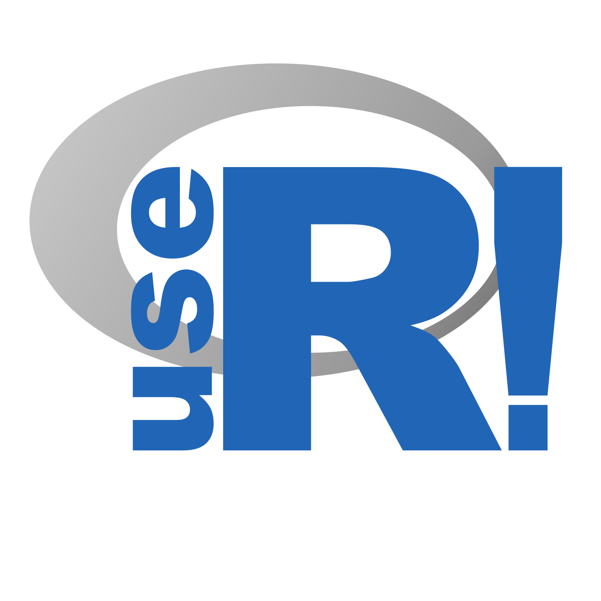

```{r setup, include=FALSE}
library(knitr)
library(fontawesome)
library(tidyverse)
library(metathis)
library(logitr)

options(
  htmltools.dir.version = FALSE,
  knitr.table.format = "html",
  knitr.kable.NA = '',
  dplyr.width = Inf,
  width = 250
)

knitr::opts_chunk$set(
  cache = FALSE,
  warning = FALSE,
  message = FALSE,
  fig.path = "figs/",
  fig.width = 7.252,
  fig.height = 4,
  comment = "#>",
  fig.retina = 3
)

# Setup xaringanExtra options
xaringanExtra::use_xaringan_extra(c(
  "tile_view", "panelset", "share_again"))
xaringanExtra::style_share_again(share_buttons = "none")
xaringanExtra::use_extra_styles(
  hover_code_line = TRUE,
  mute_unhighlighted_code = FALSE
)

# Set up website metadata
meta() %>%
  meta_general(
    description = rmarkdown::metadata$title,
    generator = "xaringan and remark.js"
  ) %>%
  meta_name("github-repo" = "jhelvy/2021-useR-healthy-hands") %>%
  meta_social(
    title = rmarkdown::metadata$title,
    url = "https://jhelvy.com",
    og_type = "website",
    og_author = "John Paul Helveston",
    twitter_card_type = "summary_large_image",
    twitter_creator = "@johnhelveston"
  )

knitr::opts_chunk$set(
    warning = FALSE,
    message = FALSE,
    comment = "#>",
    fig.path = "figs/",
    fig.retina = 3 # Better figure resolution
)
```

layout: true

<!-- this adds the link footer to all slides, depends on my-footer class in css-->

<div class="footer-small">
<span>
https://github.com/jhelvy/2021-useR-healthy-hands
</span>
</div>

---

name: title-slide
class: inverse, middle

# Healthier ❤️ & Happier 😄 Hands 🙌

.leftcol70[
## Software and Hardware Solutions for More Ergonomic Typing

### by John Paul Helveston

### 2021 useR! Conference
]

.rightcol30[
<br><center>

</center>
]

???

Hi everyone, my name is John Paul Helveston 

and I want to talk about solutions to keep our hands healthy

---

class: center
background-color: #fff

## **Last year I typed 7.5 million key strokes**

<center>

</center>

???

If you're like me and use R on a daily basis, 

chances are you are probably racking up some serious 

mileage on your keyboard. 

Over the past year, I myself typed 7.5 million key strokes, 

and in some months I log over 1 million.

---

background-image: url("images/hands.jpg")
background-size: contain

???

With that level of wear and tear, 

I started noticing a lot of wrist pain. 

So I began a quest to find solutions.

My goal of this talk is just to share what I've found 

in the hopes that it might be helpful for others.

---

class: inverse, middle, center

.leftcol[
# Software
<center>

</center>
]

.rightcol[
# Hardware
<center>

</center>
]

???

I've broken my talk into two categories: 

Software and Hardware

---

class: inverse, middle, center

.leftcol[
# .green[Software]
<center>

</center>
]

.rightcol[
# Hardware
<center>

</center>
]

???

So I'll start with software

---

class: center

# Disclaimer

## This talk is aimed at people who don't use Vim / Emacs

.leftcol[
<center>

</center>
]

.rightcol[
<center>

</center>
]

???

Before I go any further, I want to first say this talk is aimed 

at people who don't use platforms like Vim and Emacs.

Many of the solutions I'll mention are easily handled on these platforms, 

but they come with a learning curve, so I'm going to highlight 

some tools that are hopefully useful for any general typist.

---

class: center
background-color: #fff

# Learn to touch type

### https://www.keybr.com/

<center>

</center>

???

I'll start with some really basic suggestions 

and my first is simply to learn to touch type

and by that I mean learn to use all 10 fingers

while typing. And that's really just to be efficient.

There are some great free tools out there 

for learning. My personal favorite is key-br-dot-com.

---

class: middle, center
background-color: #fff

<center>

</center>

???

The other thing I'll note on this is that I personally haven't 

seen much benefit to learning alternative keyboard layouts. 

So the default QWERTY layout is actually not very great,

And while you can gain a little bit of typing speed by 

learning an alternative like DVORAK or COLEMAK, it's much, much 

more important that you learn ANY layout really well. 

So if you're just starting, maybe start with a different layout, 

but if you already touch type, it's more important that you get

good at it.

---

# .center[Learn shortcuts]

---

Use a text expander

---

Remap your keyboard

---

Use layers

Navigation with layers

---

More important to learn at least _a_ layout

(learn to touch type)


---

class: inverse, middle, center

.leftcol[
# Software
<center>

</center>
]

.rightcol[
# .green[Hardware]
<center>

</center>
]

???

So that was a lot of different software solutions

and hopefully some of those will work well for you

But there's also a lot to be gained by carefully 

considering the hardware you use.

---

Use a timer

???

While I'm mostly going to talk about which keyboard you use,

I want to start by saying that 

---

Use a split keyboard

(inexpensive first)

---

Use a split keyboard _that has thumb keys_

---

Use a split keyboard _that is programmable_

---

class: inverse

<br>

# .center[.font150[Thanks!]]

### Slides: https://jhelvy.github.io/2021-useR-healthy-hands

.footer-large[
.right[
@johnhelveston `r fa(name = "twitter", fill = "white")`<br>
@jhelvy `r fa(name = "github", fill = "white")`<br>
@jhelvy `r fa(name = "weixin", fill = "white")`<br>
jhelvy.com `r fa(name = "link", fill = "white")`<br>
jph@gwu.edu `r fa(name = "paper-plane", fill = "white")`
]]
